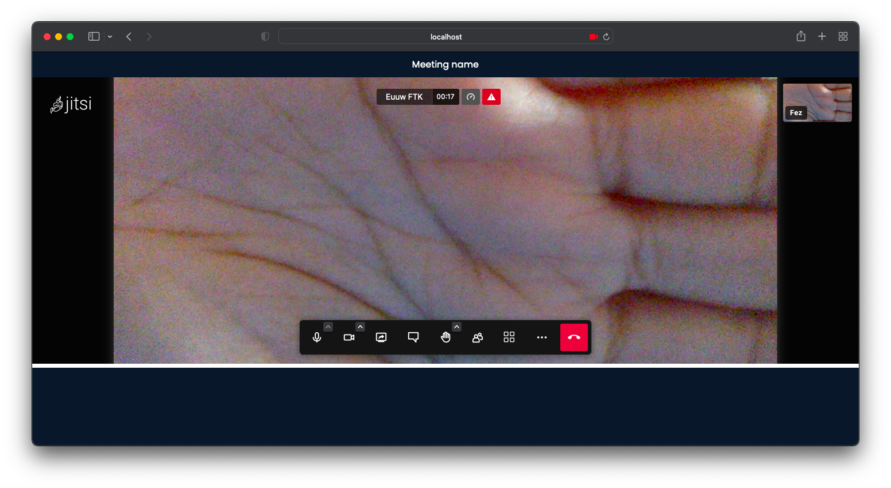
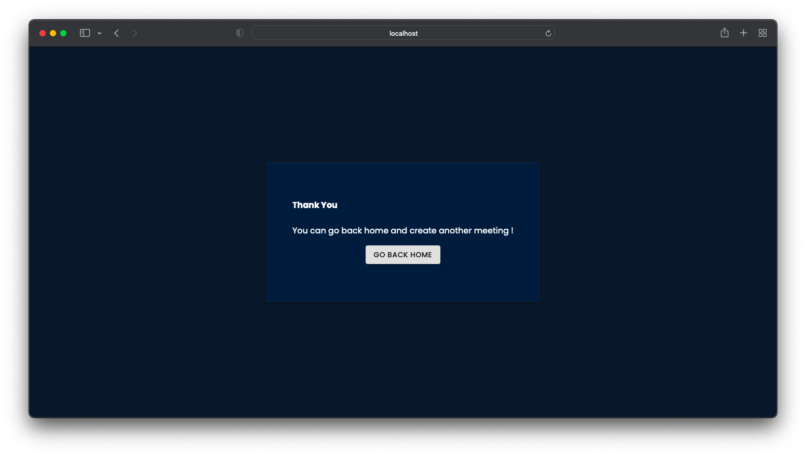

# Introduction

This is related to the medium article published on 26th March 2022.

[Medium Article Link](https://shelcia.medium.com/create-a-video-call-web-app-in-10-minutes-with-jitsi-and-react-5453032f2173)

## To work with this

- Clone this Repo
- Run `npm install`
- Then run `npm start`
- Open `http://localhost:3000`

## Deployment

[Deployment Link](https://jitsi-video-app.netlify.app/)

## Pages

